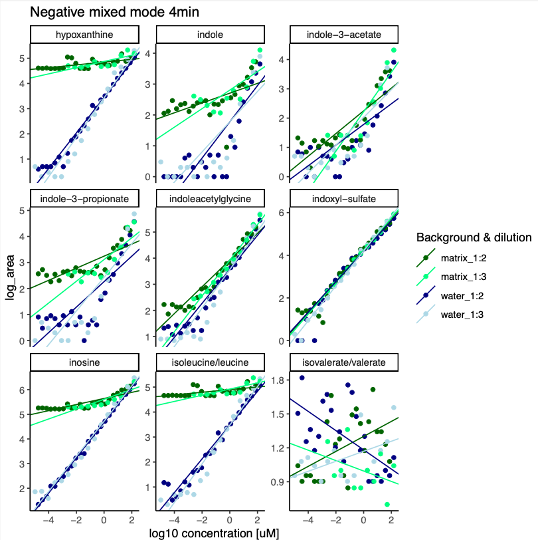
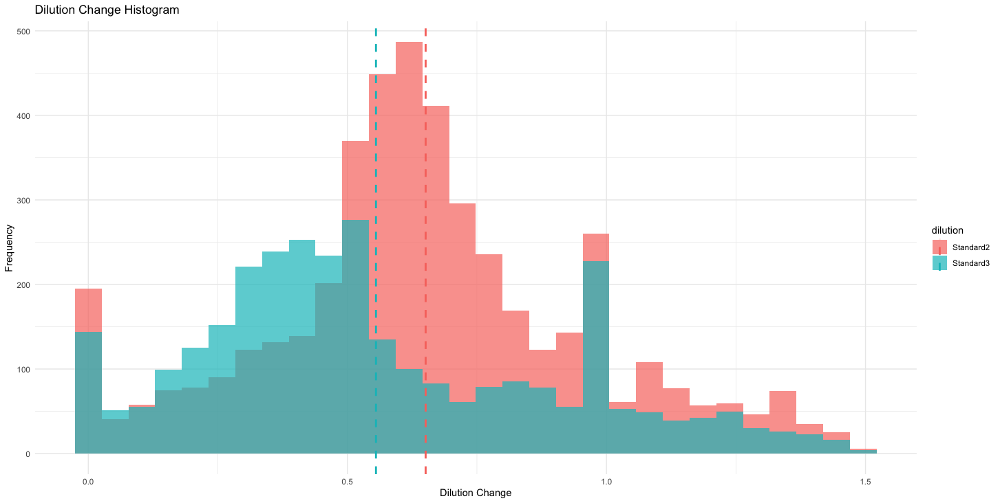
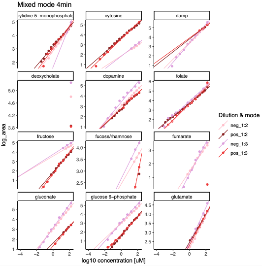

#Standardcurve comparison between 4min column and 15min column on mixed mode

In this repository, we will perform a comparison of a standard dilution series of 128 mixed standards measured in a 1:2 dilution series and 1:3 dilution series. Both dilution series were measured in water background (extraction buffer) and matrix background (dilution of murine cecal content). The samples were measured using mixed-mode settings in both positive and negative mode on a ZenoTOF. We also match the 4min standard mix with a single-standard library.

Packages required for this pipeline can be found [here](src/metabolomics_packages.R) and we thank the authors for writing and uploading these!

Here, we perform multiple comparisons:

1. Linearity check of the 1:2 and 1:3 standard dilution on a water background for the 4min column
2. Fitting of the linear model for both 1:2 and 1:3 dilutionseries in both positive and negative mode
3. Library matching in both positive and negative mode for the measured retention times
4. Linearity check of the 1:3 standard dilution on a water background for the 15min column
5. Fitting of the linear model for both 4min and 15min column with the 1:3 dilutionseries in both positive and negative mode
6. Determination of the detection limits for both the 4min and 15min column based on the linearity of the standard dilution change

##01 Data import 4min metabolomics data

First, we import annotated metabolomics data (from Skyline peak-matching) and extract the metadata from the filename using forstringr. We then match the log-transformed concentrations of the respective standard concentrations with the log-transformed area under the peak measurements in order to continue with future calculations.

##02 Matrix effects

In order to visualize matrix effects for each metabolite in both positive and negative mode, we first divide the cleaned up data file into positive and negative mode measurements in order to fit two different linear models and standard curves based on mode. We fit the linear models based on the log-transformed concentrations and log-transformed area under the peak measurement for each metabolite, background and dilutionseries individually.
We then facet_paginate the different metabolites, visualizing the different standard dilutions in both matrix and water. An example of part of the multi-page pdf looks like this:

##03 Linearity of standard curves cut-off

As the detection limit is reached, standard curves lose their linearity and are thus difficult to fit. Here, we perform a "linearity check" by calculating the dilution change from one dilution factor to the next, only in water as background. The dilution change is calculated by dividing the measured area of a given dilutionfactor by the area of the measured area of the previous dilution factor. The resulting dilution_changes in both 1:2 dilution and 1:3 dilution look as following:

We therefore use a range of +/- 0.25 from the "perfect" dilution change (0.5 for 1:2 and 0.33 for 1:3) and remove all rows as soon as this range is not met. We then fit the linear model again, this time for each molecule, each mode and each dilutionseries individually. We then facet_paginate the different metabolits, visualizing the different standard dilutions in both modes. An example of part of the multi-page pdf looks like this:

